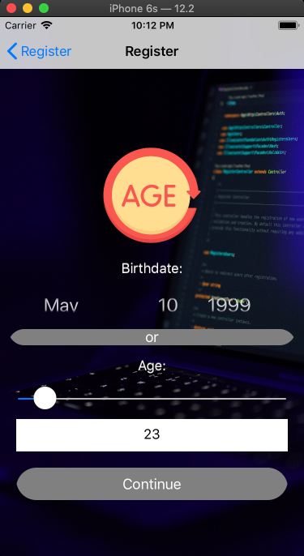
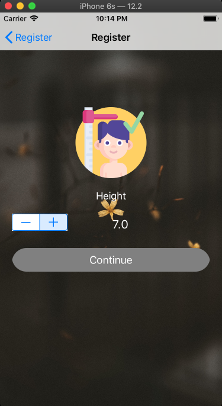
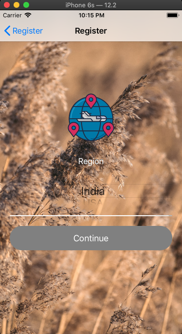
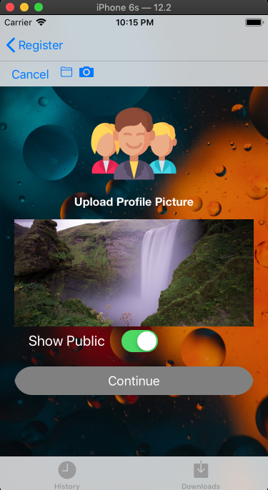

# Simple Registration Form
 Registration form using swift
 
 
 #### UIElements
 
 - UILabel
 - UITextField
 - UITextView
 - UIButton
 - UIDatePicker
 - UISegmentedControl
 - UISlider
 - UIStepper
 - UISwitch
 - UIActivityIndicatorView
 - UIImageView
 - UIProgressView
 - UIPickerView
 - UIToolbar
 - UITabBar
 - UIImagePickerController

 #### Requirements
 
  - iOS 12+
  - Xcode 12+
  - Swift 5.1+

 #### Features
 
  - [x] Several form items, such as textfield, buttons, sliders
  - [x] Some form items can expand/collapse, such as datepicker, pickerview
  - [x] Align textfields across multiple rows
  - [x] Strongly Typed
  - [x] Pure Swift
  - [x] No 3rd party dependencies
  
  
 #### Output
 

 

  
